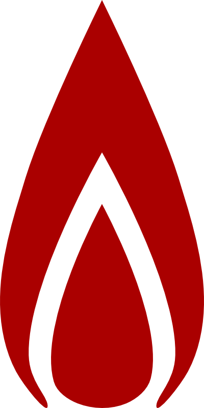

# Please.beer
Please.beer / HN clone made with React and Meteor (front-end)

##Development environment setup
After cloning the repository, run `npm install` to install all dependencies, and
`gulp` to start the development server. Unit tests are run in node, and the
result is available on the command line, or at `localhost:8080/tests/`.
